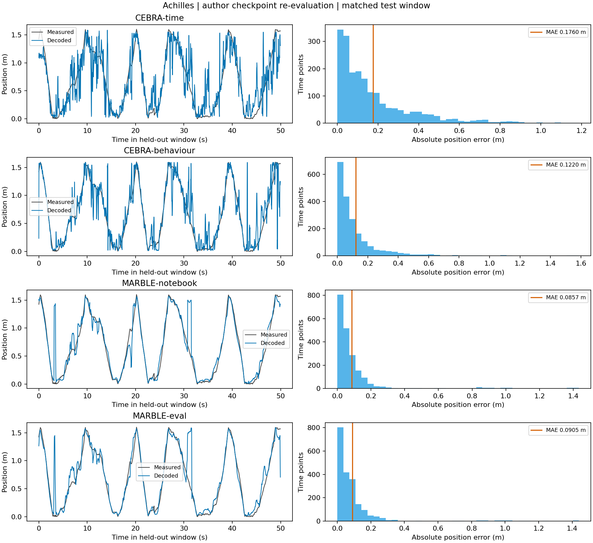

# Fig. 5c–d 首轮重评估

后续已在 [CUDA 13 / PyTorch 2.14 稳定版环境](gpu/README.md)完成三个种子的从头训练，详见 [训练报告](TRAINING_REPORT.md)。环境由 uv 管理。下文保留首轮 CPU 检查点重评估的原始记录。

2026-09-22 已在 `LevelDownRefine/MARBLE` 的独立环境中运行完成。范围是 **Achilles 记录上作者检查点的离线位置解码**：没有重新训练 MARBLE 或 CEBRA；重新拟合了各自的位置解码器。

先读 [数据与代码链说明](READING.md)。本次 MARBLE 的 Python 源码实际来自本 fork，运行记录已校验。

## 数据链

输入 `neural` 为 10,000×120，表示 10,000 个时间 bin、120 个神经元；标签为 10,000×3，包含位置和运动方向信息。记录采样率为 40 Hz。

前 8,000 个 bin 为训练段，后 2,000 个为测试段。官方预处理及差分后，MARBLE 的训练和测试神经状态分别为 7,999×20、1,999×20。作者模型产生 32 维表征，然后以 36 邻居、余弦距离的 kNN 预测位置。

所有主指标统一评价测试段前 1,999 个点。CEBRA 未裁去最后一个点的原生指标也保存在 JSON 中，避免把评价窗口变化混入模型差异。

## 实测结果

| 设置 | 位置 MAE（米） | 位置 MAE（厘米） | 位置 R² |
| --- | ---: | ---: | ---: |
| CEBRA-time | 0.176014 | 17.60 | 0.760060 |
| CEBRA-behaviour | 0.122013 | 12.20 | 0.838268 |
| MARBLE，notebook 默认 train 模式 | 0.085685 | 8.57 | 0.881431 |
| MARBLE，显式 eval 模式 | 0.090542 | 9.05 | 0.878411 |

在本记录与本协议下，两个 MARBLE 设置的位置误差均小于这两个作者 CEBRA 检查点。该比较不等于重新验证表示模型的训练过程，也不支持跨动物总体结论。

公开结果快照：[rat-20260922-114432](reports/rat-20260922-114432/)。完整运行目录位于本地 `results/rat-20260922-114432/`。

- [轨迹与误差图](reports/rat-20260922-114432/decoding.png)，另有 SVG。
- [完整数值](reports/rat-20260922-114432/metrics.json)。
- [环境与文件校验值](reports/rat-20260922-114432/provenance.json)，公开版省略了本机绝对路径。
- [运行日志](reports/rat-20260922-114432/run.log)；预测、标签、表征和测试索引保存在本地完整运行目录的 `arrays.npz` 中。



本轮使用 CPU 4 线程；计算阶段耗时见 metrics.json，不含启动时依赖导入，也不代表从头训练时间。

## 独立环境与运行

当前验证环境：Windows、Python 3.12.10、PyTorch 2.5.1 CPU、PyG 2.1.0.post1、NumPy 1.26.4、scikit-learn 1.3.2、CEBRA 0.4.0。Python 依赖由 `uv.lock` 固定，MARBLE 以 editable 方式安装当前 fork。环境安装包含 Cython 编译，Windows 需要 Visual Studio C++ Build Tools 和 Windows SDK。

在仓库根目录执行，首次安装时将 Python 路径替换成自己的 Python 3.12：

```powershell
Set-Location reproduction
.\tools\setup.ps1 -Python 'C:\path\to\python.exe'
.\.venv\Scripts\python.exe tools/prepare_data.py
.\tools\check.ps1
.\tools\run_rat.ps1
```

本机环境和数据已就绪，只需执行 `tools/run_rat.ps1`。每次自动创建新的时间戳结果目录；显式指定已存在的目录会报错，避免覆盖。

若已有同名作者文件，可从本地目录复制；准备工具先核对固定大小和 SHA-256，再复制和复核：

```powershell
.\.venv\Scripts\python.exe tools/prepare_data.py --source-directory 'C:\path\to\rat'
```

数据和大文件结果保存在被 Git 忽略的目录中。首次下载链接见 [data_manifest.json](data_manifest.json)；Git 中保留指标、图表和日志快照，新克隆需重新获取数据并运行脚本才能生成完整实验文件。

## 验证与解释边界

本轮 7 项 unittest、3 项原仓库 pytest、ruff 检查通过。测试覆盖：导入本 fork、时间划分、指标与长度检查、损坏文件拒绝、无扩散模型省略完整谱的输出一致性，以及 CPU 设备适配保持 CEBRA 预测一致。

本轮还核对了记录在 `provenance.json` 中的源码及锁文件哈希，均与当前运行代码一致；图已视觉检查。整理导入格式后，另起进程再次运行；两轮的 14 个保存数组逐值一致，包括表征、预测、误差和测试索引。这是同机同环境的重复性检查，尚未进行跨机器或从头训练验证。

主要限制与差异：

- `MARBLE-notebook` 保留官方代码默认的 train 模式，batch normalization 会使用测试批次统计量；`MARBLE-eval` 独立加载同一权重后使用冻结统计量。它们是两条明确区分的协议。
- PCA=20 遵循 notebook，论文 Methods 写 PCA=5；scikit-learn 1.3.2 固定了与作者权重兼容的 randomized PCA 行为。
- 原始 bin 为 25 ms，而官方平滑函数把 bin 索引当作毫秒，并将非零计数转换为一次事件。实际数据中共有 8,971 个神经元×时间 bin 的计数大于 1。本轮保留作者实现，后续物理单位修正必须搭配新的训练和对照。
- 仅在检查点 `diffusion=False` 时将谱计算限为一个特征对；回归测试验证了无扩散输出不依赖该谱。
- 测试图使用完整测试窗口构建，属于离线解码；相关时间点不作为独立动物样本。本轮报告描述性指标，不报告新的显著性结论。

后续从头训练及固定划分下的比较已在 [训练报告](TRAINING_REPORT.md)中单独记录。仍不能把上述“作者模型重评估”或三个种子的单动物实验标成“全论文复现完成”。
