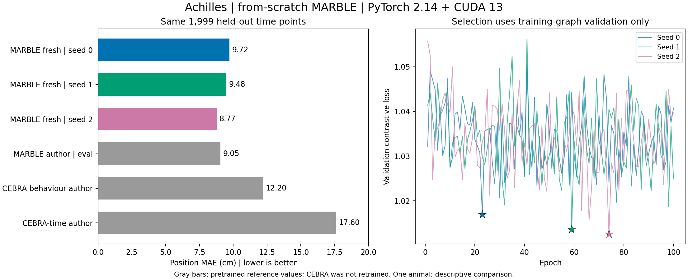

# MARBLE 从头训练：Achilles，三个随机种子

2026-09-22 已完成。使用官方稳定版 **PyTorch 2.14.0+cu130、CUDA 13.0、uv 锁定环境**，在 RTX 5070 Ti Laptop GPU 上，随机初始化 MARBLE 并分别训练 100 轮。三个种子的主评估位置 MAE 为 **9.72、9.48、8.77 cm**，均值 **9.32 cm**，种子间样本标准差 **0.49 cm**。

这是单只动物、固定时间划分下的从头训练结果。与本地作者权重重评估接近；尚不能称为全论文或完全一致的复现。

## 固定协议

- 公开 Achilles 数据：10,000 个时间 bin、120 个神经元；数据 SHA-256 与固定清单一致。
- 前 8,000 个 bin 用于训练，最后 2,000 个用于测试；PCA 仅在训练段拟合，20 维；差分后分别为 7,999 和 1,999 个节点。
- 保留原代码的平滑、构图和邻居采样。预处理及图内节点划分固定 seed=0；网络初始化和训练采样的种子为 0、1、2。
- 使用公开 MARBLE 检查点中的参数配置：一阶梯度、无扩散、完整邻居、包含神经状态坐标、隐藏层 64、输出 32、batch size=64、SGD lr=1、momentum=0.9、100 轮。没有载入作者网络权重或优化器状态。
- 最佳模型仅按**训练图内部验证节点的对比损失**选择，分别为第 23、59、74 轮。训练段内部的采样遵循原作者实现，可连接该训练图的不同节点划分；整段外部测试数据不参与优化或模型选择。
- 主评估显式使用 `eval()`，冻结 BN 统计量；再用训练段位置标签拟合 36 邻居、余弦距离的 kNN 解码器。所有结果使用完全相同的 1,999 个测试时间点。

## 实测数值

| 随机种子 | 主评估 MAE（cm，eval） | 位置 R² | notebook 模式 MAE（cm） | 训练阶段耗时（s） |
| --- | ---: | ---: | ---: | ---: |
| 0 | 9.7165 | 0.885658 | 9.3375 | 44.62 |
| 1 | 9.4825 | 0.887361 | 8.8205 | 47.09 |
| 2 | 8.7696 | 0.909400 | 8.5150 | 45.58 |
| 均值 ± 种子间样本标准差 | **9.3229 ± 0.4932** | — | **8.8910 ± 0.4157** | — |

这里的标准差描述三个初始化/采样种子的波动，不是跨动物置信区间，也不是测试时间点的误差标准差。`notebook` 模式会使用测试批次的 BN 统计量，作为次要对照单独报告。

此前同一评价窗口下的**作者权重本地重评估**：MARBLE-eval 为 9.0542 cm、MARBLE-notebook 为 8.5685 cm；CEBRA-behaviour 为 12.2013 cm，CEBRA-time 为 17.6014 cm。这些数字不是从论文图片中读取的原始发表数值。

从头训练的主评估均值比作者权重本地重评估高约 **0.27 cm（2.97%）**，三个种子的误差范围为 8.77–9.72 cm。三次结果均低于上述两个 CEBRA 检查点的本地误差，但本轮没有从头训练 CEBRA，作者检查点的训练历史也未独立核实，因此此处只作描述性参照，不据此宣称完成公平的算法优劣比较或显著性检验。

## GPU 兼容性与核验

原论文使用的旧图扩展没有对应 PyTorch 2.14 的 Windows 预编译包。本次保留原 CPU 预处理与采样，将固定梯度核、全部采样节点和随机初始化参数导出到 CUDA 环境。GPU 使用原生稀疏乘法、等价编码器结构、相同损失、SGD 和按训练损失调整学习率的调度器。作者仓库的 `MARBLE/` 源码未修改。具体实现与复运行命令见 [GPU 环境说明](gpu/README.md)。

特别保留了原采样中的重复节点。直接为每个节点缓存一份梯度特征不能复现重复列带来的贡献；适配器以采样节点的出现次数加权，再做稀疏乘法，保持原运算的代数含义。该实现只覆盖本报告的固定配置。

核验结果：

- 10 项 unittest、3 项上游 pytest、ruff 均通过。
- 真实训练图上连续三次 SGD 更新与原代码对照通过：特征最大绝对差约 2.00×10⁻⁵，表征差约 3.58×10⁻⁷，损失差为 0，权重差约 2.01×10⁻⁷。BN running variance 的最大绝对差为 0.001465，满足相对容差；采用的组合容差为 `atol=2e-5, rtol=2e-4`。
- 三个训练后的最佳检查点均重新载入未修改的 MARBLE 源码。GPU 与原代码测试表征的最大绝对差分别为 2.68×10⁻⁷、2.68×10⁻⁷、4.32×10⁻⁷。
- 三个初始权重哈希各不相同，均不同于作者权重；训练后权重均发生变化。三个种子的输入图哈希一致，测试标签和全局时间索引与此前重评估逐值一致。
- 运行记录中的源码、依赖文件哈希已复核，与实际执行文件一致。

预处理及三个种子的全部采样导出共耗时 87.21 s；GPU 阶段（含真实数据核验和三个种子的训练及表征导出）145.23 s。PyTorch 峰值已分配显存约 936.59 MiB，不含其他程序与驱动占用。关闭 TF32；稀疏 CUDA 浮点运算不承诺逐位确定性。

## 解释边界与下一步

原训练 notebook 存在使用整段记录拟合的分支；本次明确只在前 80% 数据上训练。学习率 1 来自公开检查点；训练 notebook 未显式设置时，当前源码默认值为 0.01。这两处差异使本轮不能被表述为逐行完全复刻作者训练 notebook。

另外，本次仍保留作者预处理把 25 ms bin 索引当毫秒、将非零 spike count 视为一次事件的行为；PCA=20 与论文 Methods 的 PCA=5 也有差异。测试图使用整个测试窗口，属于离线解码。其他动物、其他论文图、CEBRA 从头训练和上述预处理修正尚未完成。

下一阶段可优先增加其他动物，并在同一时间划分下训练 CEBRA；物理时间单位修正应作为另一个明确标记的对照实验。

## 本次记录

- [汇总数值](reports/train-gpu-20260922-194834/summary.json)
- [完整实验协议](reports/train-gpu-20260922-194834/protocol.json)
- [源码与环境记录](reports/train-gpu-20260922-194834/provenance.json)
- [真实数据 GPU 数值核验](reports/train-gpu-20260922-194834/gpu_validation.json)
- [GPU 训练日志](reports/train-gpu-20260922-194834/gpu.log)
- 各种子的曲线与轨迹：[seed 0](reports/train-gpu-20260922-194834/seed-0/training.png)、[seed 1](reports/train-gpu-20260922-194834/seed-1/training.png)、[seed 2](reports/train-gpu-20260922-194834/seed-2/training.png)。

上述链接指向可在 GitHub 查看的小型公开快照，包含数值、图表和日志；环境摘要省略了本机绝对路径，日志中的仓库路径记为 `<repo>`。

本地 `results/train-gpu-20260922-194834/` 还保留原始图、逐批采样节点、初始参数、最佳和末轮检查点、完整损失历史及预测数组。这些大文件被 Git 忽略，可通过运行脚本重新生成。
